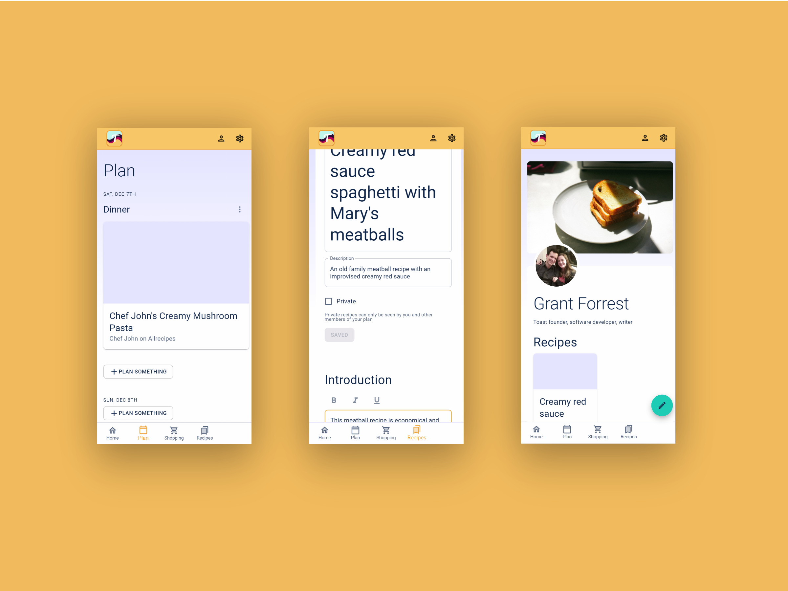

# Toast

> **Note on current status**
> I originally created this app as a startup idea. I still think it's cool, but I've decided I'm not in a position to be an entrepreneur, so I'm open sourcing it as a showcase of my experience in React, graph database technology, serverless architecture, and other things.
> If you can learn from it, great!

Toast is a meal planning app. Each directory in `services` is a relevant service.

## Developing

This repo uses `lerna` to orchestrate interdependent microservices in the `services` directory.

### Setup & Dependencies

To start, `npm i -g lerna`. This installs the CLI.

To install all dependencies for all services, run `lerna bootstrap` in the root directory.

To add a new dependency to a specific service, run `lerna add <dependency> --scope=<service name>`, where service name is like "`toast-ui`".

### Developing Locally

The best way to develop locally is to connect to the development environment in Google Cloud. The development environment includes the core database, media storage, and identity management.

Once you have service account credentials, you can run `npm run devenv:start` from the `toast-core` service to spin up the dev database. It automatically sleeps at midnight.

To run any service, run `npm run dev` in its module directory.

I'm not honestly sure how to set up a development environment that doesn't rely on Google Cloud yet. The main trick is identity management. If there's a good local mock of that or something similar, you could theoretically run ArangoDB locally and maybe just ignore (or mock) media storage.

### Deploying

Commits to `master` deploy to prod automatically. See the `cloudbuild.yaml`.

## Services

Toast has a few core services:

### toast-core

The main GraphQL API. Does most of the talking to the database. Runs on a library I created called [`graphql-arangodb`](https://github.com/a-type/graphql-arangodb) which translates GraphQL queries into ArangoDB queries. Most of the querying logic is found in the schema itself, in the form of directives which contain database query fragments.

### toast-ui

The React UI. Speaks only to the core API. Written as a progressive app, which is meant to be 'installed' on phones.

### toast-scanning

A microservice to scrape recipe websites and process the data into the Toast schema. It powers the scanner feature which allows users to bring their own recipes from around the internet.

### toast-billing

Responsible for handling Stripe webhooks and updating user subscription information.
